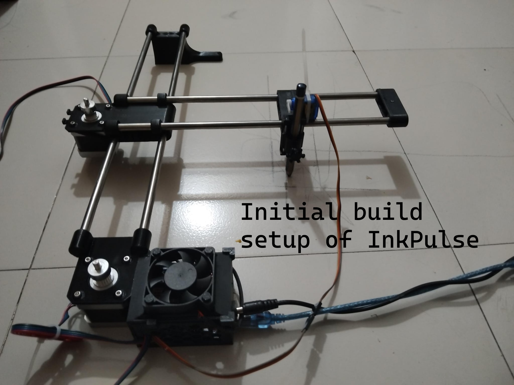
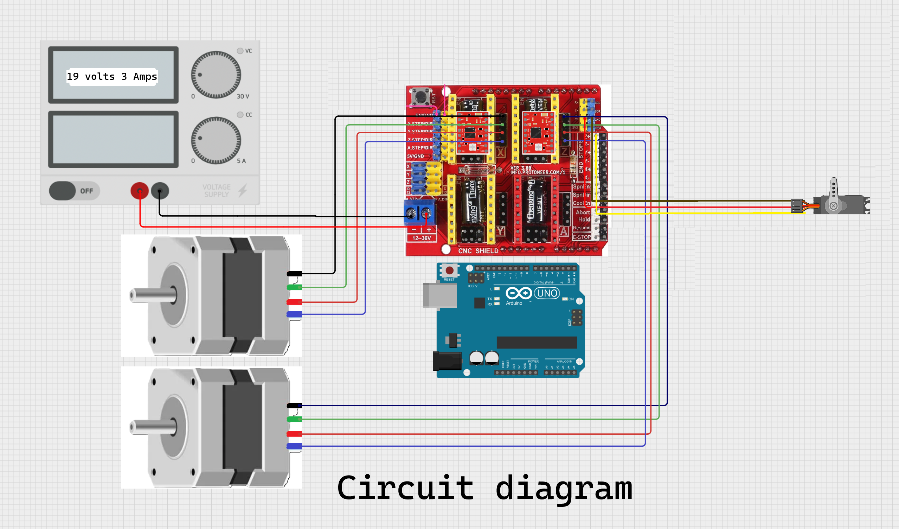

# 🖊️ InkPulse — High-Speed Ultra-Low-Cost CNC XY Plotter

**InkPulse** is a custom-built, ultra-low-cost, high-speed automated XY-plotter designed to draw vector artwork and render handwritten text with extreme accuracy. Built from scratch without expensive linear bearings, this project pushes the limits of DIY hardware optimization through low-cost 3D printing and custom firmware hacking.

---

## 🌟 Key Features & Engineering Highlights

* **Ultra-Low Cost Engineering:** Replaced expensive LM8UU linear bearings with custom 3D-printed friction-based rod guides, lowering construction costs significantly compared to typical DIY plotters.
* **Firmware Register-Level Pin Remapping:** Custom **GRBL-Servo 0.9i** firmware running at **115200 Baud Rate**, remapped directly at `cpu_map_atmega328p.h` level. Y-axis pins (Step: 4, Dir: 7) were swapped with Z-axis pins (Step: 3, Dir: 6) to drive the pen lift via standard Z-slot G-code commands (`M3`/`M5`).
* **High-Speed Acceleration:** Powered by a 19V 3A DC power supply and GT2 belt-drive system, tuned to achieve up to **10,000 mm/min** maximum feed rate and **500 mm/sec²** acceleration.
* **Electrical Noise Mitigation:** Integrated a 50V 1000µF decoupling capacitor in parallel across the SG90/MG90S servo line to eliminate voltage spikes and prevent Arduino serial disconnects.

---

## 🛠️ Hardware & Components List

| Component | Description |
| :--- | :--- |
| **Controller** | Arduino Uno R3 |
| **Shield** | CNC Shield V3 |
| **Drivers** | A4988 Stepper Drivers (1/16 microstepping) |
|**Motors** | Nema 17 45Ncm stepper motor|
| **Power Supply** | 19V 3A DC Adapter |
| **Pen Lift** | SG90 / MG90S Micro Servo Motor |
| **Drive System** | GT2 Belts & 20-Tooth Pulleys |
| **Structure** | Custom 3D Printed Rod Guides + Smooth Steel Rods |
| **Power Filter**| 1000uF Electrolytic Capacitor |
|**Others**| Cooling fan, holding parts(screw, zip tie) |

---

## 📷 Photos & Video Demonstration

### Project Build & Working Demo

🎬 **Watch Video Demo:** [Click here to view the plotter in action](WhatsApp%20Video%202026-10-04%20at%2010.53.54%20PM_squished.mp4)

---

## ⚙️️ Custom GRBL Settings
